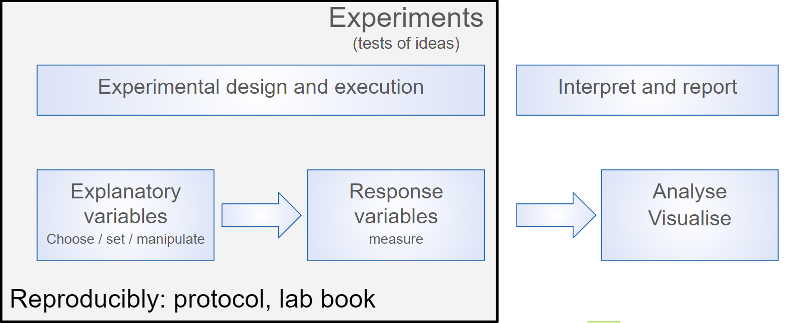
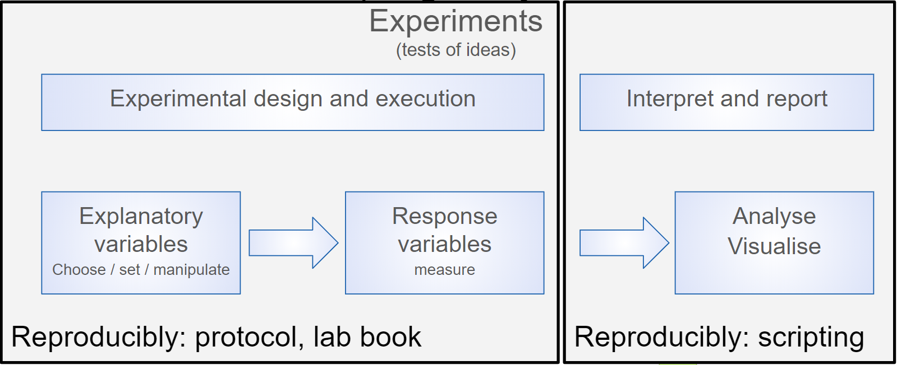

```{r define-style, include = FALSE}
# xaringanthemer ---------------------------------------------------------------
library(xaringanthemer)
style_duo_accent(
  primary_color = "#7DCBC1", # soft pink
  secondary_color = "#449EAD", # soft cyan
  link_color = "#4485ad", # blue
  code_highlight_color = "#F9E5AF", # light-yellow
  code_inline_color = "#A7A7A7", # gray
  base_font_size = "35px",
  header_h1_font_size = "2.5rem",
  header_h2_font_size = "2rem",
  header_h3_font_size = "1.75rem",
  text_font_google = google_font("Source Sans Pro"),
  text_font_family = xaringanthemer_font_default("text_font_family"),
  text_font_weight = xaringanthemer_font_default("text_font_weight"),
  text_font_url = xaringanthemer_font_default("text_font_url"),
  text_font_family_fallback = xaringanthemer_font_default("text_font_family_fallback"),
  text_font_base = "sans-serif",
  code_font_google = google_font("Source Sans Code"),
  code_font_family = xaringanthemer_font_default("code_font_family"),
  code_font_size = "25px",
  code_font_url = xaringanthemer_font_default("code_font_url"),
  code_font_family_fallback = xaringanthemer_font_default("code_font_family_fallback"),
  outfile = "style-xaringanthemer.css"
)

# R options --------------------------------------------------------------------
options(
  htmltools.dir.version = FALSE,
  dplyr.print_min = 6,
  dplyr.print_max = 6,
  tibble.width = 65,
  width = 65
)

# figure height, width, dpi ----------------------------------------------------

knitr::opts_chunk$set(
  echo = TRUE,
  fig.width = 8,
  fig.asp = 0.618,
  out.width = "60%",
  fig.align = "center",
  dpi = 300,
  message = FALSE
)

# ggplot2 ----------------------------------------------------------------------
ggplot2::theme_set(ggplot2::theme_minimal(base_size = 18))


# xaringanExtra ----------------------------------------------------------------
library(xaringanExtra)
xaringanExtra::use_panelset()

# hook for setting output number of lines --------------------------------------
hook_output <- knitr::knit_hooks$get("output")
knitr::knit_hooks$set(output = function(x, options) {
  lines <- options$output.lines
  if (is.null(lines)) {
    return(hook_output(x, options)) # pass to default hook
  }
  x <- unlist(strsplit(x, "\n"))
  more <- "..."
  if (length(lines) == 1) { # first n lines
    if (length(x) > lines) {
      # truncate the output, but add ....
      x <- c(head(x, lines), more)
    }
  } else {
    x <- c(more, x[lines], more)
  }
  # paste these lines together
  x <- paste(c(x, ""), collapse = "\n")
  hook_output(x, options)
})


# Referencing ------------------------------------------------------------------
library(RefManageR)
BibOptions(
  check.entries = FALSE,
  bib.style = "authoryear",
  cite.style = "authoryear",
  style = "markdown",
  hyperlink = FALSE,
  dashed = FALSE,
  longnamesfirst = FALSE,
  max.names = 2
)
myBib <- ReadBib("bibliography.bib", check = FALSE)
```

layout: true
  
<div class="my-footer">
<span>
<a href="https://bit.ly/3mma-dda" target="_blank">🔗 bit.ly/3mma-dda</a>
</span>
</div> 

<!-- Presenting on zoom or similar? Press C to clone your slides, then P for presenter mode for one set. You can share the whole screen version of the slides while still seeing you presenter view -->

---

## You can make an R package too!


picture of upside funnel

---
class: middle, inverse

# About you!

---

Go to https://www.menti.com/

```{r echo = FALSE, out.width = "48%"}

```

---

## You are not alone!

Expectations of Stage 1 Biologists about Data Analysis.

Responses to the question 'I will enjoy data analysis.'

--

```{r echo = FALSE, out.width = "100%"}

```

---

## You are not alone!

```{r echo = FALSE, out.width = "20%",}

```

"*Nobody wants to learn to code. They just want to kick ass*."

.small[
James Long rstudio::conf 2019
Putting empathy in action Building a 'community of practice' for analytics in a global corporation. 
]
---

## Me

.pull-left[

```{r echo = FALSE, out.width = "35%", fig.show='hold'}
logos <- c("images/rforwards.png", "images/transparent-cloud-only.PNG")
knitr::include_graphics(logos)
```
]

.pull-right[
Emma Rand  

Senior Lecturer, Computational Biology  
Department of Biology, University of York, UK 

[R Forwards](https://forwards.github.io/)

[Cloud-SPAN](https://cloud-span.york.ac.uk/)

]


---
class: middle, inverse

# Why script?


---
## Reproducibility is key!

One definition
*"... obtaining consistent results using the same input data; computational steps, methods, and code; and conditions of analysis."*. `r Cite(myBib, "National_Academies_of_Sciences_Engineering2019-sb")`

Also see 

-  The Turing Way "Definitions for Reproducibility" `r Cite(myBib, "the_turing_way_community_2019_3233986")`
-  National Science Foundation `r Cite(myBib, "K_Bollen2015-un")`

---
## Reproducibility is key!

```{r turing-reprod-matrix, echo = FALSE, out.width="700px"}
knitr::include_graphics("images/reproducible-matrix.jpg")
```

.small[
How the Turing Way `r Cite(myBib, "the_turing_way_community_2019_3233986")` defines reproducible research
]


---

## Reproducibility is key!

* Many high profile cases of work which did not reproduce e.g. Anil Potti unravelled by `r Citet(myBib, "Baggerly2009-pw")` 


* **Will** become standard in Science and publishing e.g OECD Global Science Forum Building digital workforce capacity and skills for data-intensive science `r Cite(myBib, "OECD_Global_Science_Forum2020-cp")`

---

## It's science!

<iframe src="https://giphy.com/embed/qCj1NK1rxtnna" width="480" height="270" frameBorder="0" class="giphy-embed" allowFullScreen></iframe><p><a href="https://giphy.com/gifs/transparent-qCj1NK1rxtnna">via GIPHY</a></p>

---

## Be nice to future you!


<iframe src="https://giphy.com/embed/M11UVCRrc0LUk" width="480" height="277" frameBorder="0" class="giphy-embed" allowFullScreen></iframe><p><a href="https://giphy.com/gifs/M11UVCRrc0LUk">via GIPHY</a></p>

--

Five selfish reasons to work reproducibly `r Cite(myBib, "Markowetz2015")`. Alternatively, see the [talk](https://youtu.be/yVT07Sukv9Q)

---

## Why script

Science is the generation of ideas, designing work to test them and reporting the results.

```{r echo = FALSE, out.width="600px"}

```

.pull-left[
Generating the results
]

.pull-right[
Analysing and reporting them
]
---

## Rationale for scripting analysis

We ensure replicability of laboratory and field work by planning and recording in lab books and using standard protocols. 


```{r echo = FALSE, out.width="600px"}

```

Even so replicating results can be hard.
---

## Rationale for scripting analysis

We ensure reproducibility of laboratory and field work by planning and recording in lab books and using standard protocols. 

```{r echo = FALSE, out.width="600px"}

```


Workflows for data analysis and reporting can, and should, be 100% reproducible! Scripting is the way to achieve this.

---

## Rationale for scripting analysis

That reproducibility applies to all aspects of the data workflow.

```{r echo = FALSE, out.width="700px"}
knitr::include_graphics("images/rationale5.png")
```

--

From importing or collecting the data, processing it for analysis, building statistical models and communicating the methods and results.


---
class: middle, inverse

# Why R?


---

## Why R?

Open source and free

--
 .......But so is Python
  
--

R has reputation for catering to users who do not see themselves as programmers, and allowing them to slide gradually into programming.


```{r echo = FALSE, out.width="600px"}
knitr::include_graphics("images/biologist1.png")
```


--

Designed for data analysis and graphics - which means it is often easier to achieve those tasks in R than a general purpose programming language.

---

## Why R?

The R community is one of R's greatest assets. VGibrant, supportive, inclusive.

.pull-left[
* [#rstats](https://twitter.com/hashtag/rstats?lang=en) on twitter is very active
* [RForwards](https://forwards.github.io/about/) 
* [RLadies](https://rladies.org/) gender diversity promotion 
* [Hey! You there! You are welcome here](https://ropensci.org/blog/2017/06/23/community/)  

]

.pull-right[
```{r echo = FALSE, out.width="400px"}
knitr::include_graphics("images/welcome_to_rstats_twitter.png")
```

.tiny[
.footnote[
Artwork by @allison_horst 
]
]
]

---
class: middle, inverse

# Why make a package?

---

## Why make a package?

Conventionally:

-  Package developers  
-  Generalisable analytical methods  
-  For use on other data  
-  Public release


---

## Why make a package?

Package up your data analysis project!

-  If you are already trying to work reproducibly you almost doing it anyway!

-  It will help you do it better

-  If you are trying to work reproducibly, making a package is just a short step beyond that


---
class: middle, inverse

# How to make a package?


---

## How to make a package?

Easier than you think!

-  Use RStudio
-  Use **`devtools`** - many helper functions


---

## How to make a package?

Create a package!

```{r eval=FALSE}
usethis::create_package("myanalysis")
```

---

## How to make a package?

.pull-left[

```{r echo = FALSE, out.width="400px"}

```

]

.pull-right[

-  It is a package and an RStudio project.
-  DESCRIPTION provides metadata about your package.
-  R/ directory for code
-  NAMESPACE declares the functions you export and the external functions your work depends on

]


---

## How to make a package?

Metadata in DESCRIPTION

-  Title  
-  Version  
-  Authors  
-  Description  
-  License  


---

## How to make a package?

Document your package!

```{r eval=FALSE}
devtools::document()
```


---

## How to make a package?

Check your package!

```{r eval=FALSE}
devtools::check()
```

---

class: middle, inverse

# Summary

---

## Summary

-  You are nearly doing it anyway  
-  Encourages and supports reproducibility  
-  Helps you document your analysis  
-  Helps you test and check your analysis  
-  Is made easy with devtools and friends  

---

class: middle, inverse

# What questions do you have?

---

class: middle, inverse

# Acknowledgements

---

Slides made with: **`knitr`** `r Cite(myBib, c("knitr1", "knitr2", "knitr3"))`,**`R Markdown`** `r Cite(myBib, c("markdown1", "markdown2"))`, **`xaringan`** `r Cite(myBib, "xaringan")`, **`xaringanthemer`** `r Cite(myBib, "xaringanthemer")`, **`xaringanExtra`** `r Cite(myBib, "xaringanExtra")`

Referencing with **`RefManageR`** `r Cite(myBib, "McLean-2017")`.

---

## References

.tiny[
```{r refs1, echo = FALSE, results  ="asis"}
PrintBibliography(myBib, start = 1, end = 9)
```
]

---

## References

.tiny[
```{r refs2, echo = FALSE, results  ="asis"}
PrintBibliography(myBib, start = 10,)
```
]

---

## License

Licensed under a <a rel="license" href="http://creativecommons.org/licenses/by-nc-sa/4.0/">Creative Commons Attribution-NonCommercial-ShareAlike 4.0 International License</a>.
<a rel="license" href="http://creativecommons.org/licenses/by-nc-sa/4.0/"></a><br />
